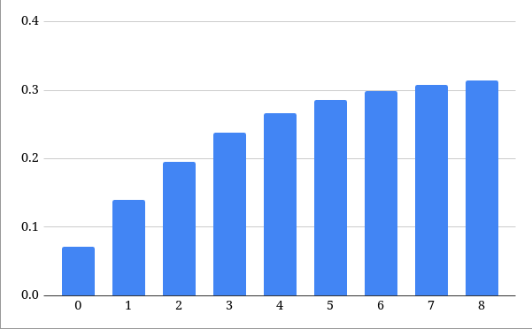

# Freefall 


This is a text simulation of [freefall](https://en.wikipedia.org/wiki/Free_fall) I made as a mini project using formulas I learned from physics class from school.


## Installation


There are two ways to install this program to your local machine, either hope I have posted a file with the executable format that your system uses, or build it yourself.


## Usage


Using this program yourself is pretty simple (if you have experience with the command line of course), the binary can be executed like so:


```bash
./freefall 10
```


The argument being passed into the program is the height you want the rock to be dropped from. 


## How It Works


### Calculations


A few computations are made prior to the actual animation, which go along the lines of this:


1. Calculate initial velocity.
2. Use $V_i$ with the formula $v = \sqrt{V_i^2 + 2 * a * 2}$ to calculate velocity at each one-second interval in the range of ${x | 0 \le x \le d}$.
3. Use the velocity results to calculate for time between each second with the formula $t = \frac{2d}{V_i + V_f}$ and add all the results to a vector, $vt$.


After all the computations are done, we can move onto the programming aspect and display the animation which is actually very simple yet trivial at the same time:


1. Set up the console for the animation (see [setup](https://github.com/floington500/Freefall/blob/b6c49bed98d9e5c3834ae1e729cb0ba2b63012fd/src/main.cpp#L12) function).
2. Traverse **backwards** through the $vt$ and print a star at the start of every iteration.
   - Going through the vector forwards would give us an animation of the object falling really quickly then slowing down at the end because the time and velocity vectors are computed using the previous result, $V_i$, to calculate for $V_f$ making the vectors linear.
3. After printing the star, delay the program for `vt[i]` seconds where `i` is the current index of the vector.
4. Replace the star with a space character as it initially was and move the cursor down one time in preparation for the next iteration.
5. Repeat this process until the end of `vt` is reached.


The code in main demonstrates this whole process pretty simply, so if you are a programmer looking for another explanation you can pay it a visit.


### Data Visualization


Here is a simple visualization of the time values that are output by the formulas in my program(see: [data_out](src/data_out.cc)): 


-  


As a reminder, the animation uses these values in reverse to delay the program in each interval of the rock falling. This was already covered [here](https://github.com/floington500/Freefall/blob/master/README.md?plain=1#L35) so no need for me to explain it again.


So for example, on the first occasion of the rock falling, the output will be delayed for 0.314039 seconds before going onto the next iteration.


## Demonstrations


I know what you are thinking, all this talk and nothing to be shown for it yet, well this is the moment you have most likely been waiting for. Here are a few examples of the freefall animation displayed by the program: 

<video width="320" height="360" controls>
  <source src="images/demo1.mp4" type="video/mp4">
</video>

<video width="320" height="360" controls>
  <source src="images/demo2.mp4" type="video/mp4">
</video>


## Conclusion


As usual, thank you for paying a visit to my project as I greatly appreciate it and if you have any suggestions or recommendations please feel free to submit it under the issues tab.